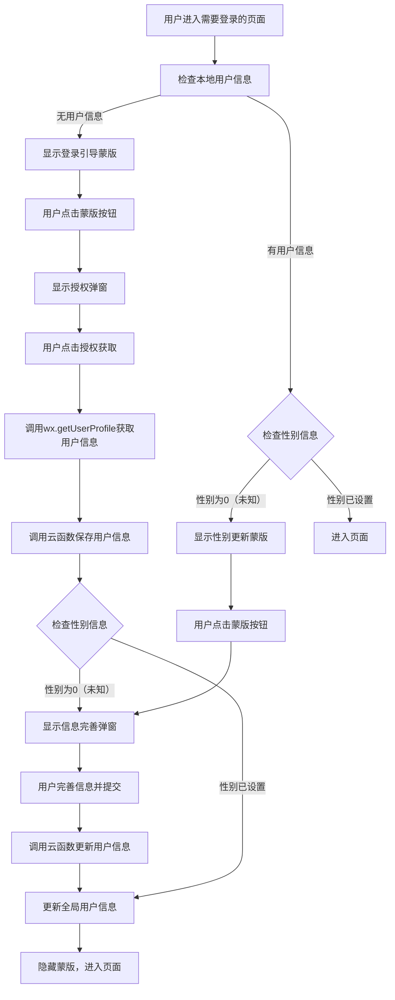
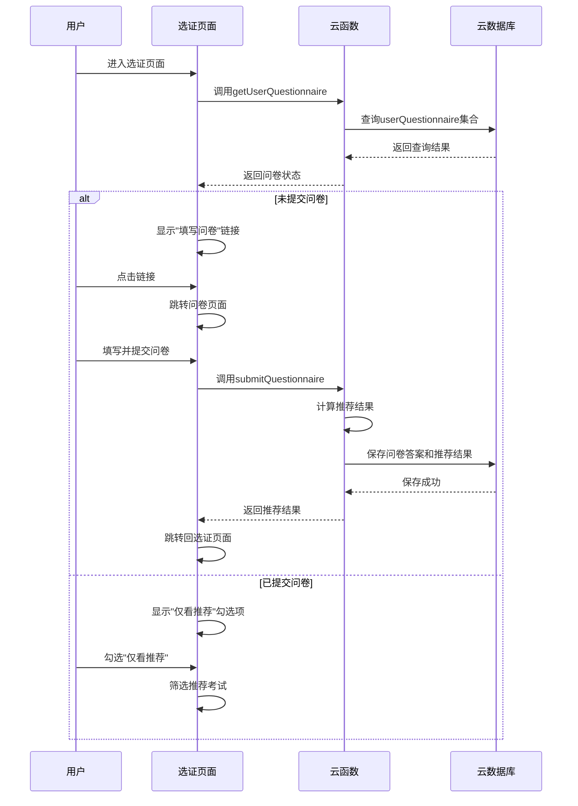

## 📄 技术方案文档 - MyCertificateJourney（我的考证之旅）

### 一、技术架构设计

#### 1.1 技术栈选择

- **前端**：微信小程序原生开发（WXML + WXSS + JavaScript）
- **后端**：微信云开发（CloudBase）
  - 云函数：处理业务逻辑
  - 云数据库：存储用户数据和考试信息
  - 云存储：存储资料文件和用户上传内容
- **第三方服务**：
  - 微信登录（OpenId获取）
  - 微信支付（未来商业化）

#### 1.2 系统架构图

```
┌─────────────────────┐
│  微信小程序前端     │
├─────────────────────┤
│  页面层（Pages）    │
│  - 首页            │
│  - 选证页面        │
│  - 学证页面        │
│  - 练习页面        │
│  - 模拟考试页面    │
│  - 考证页面        │
│  - 个人中心页面    │
│  - 问卷页面        │
├─────────────────────┤
│  组件层（Components）│
│  - 考试卡片        │
│  - 进度条          │
│  - 题目组件        │
│  - 错题本          │
│  - 云提示模态框    │
├─────────────────────┤
│  网络层（Network）  │
│  - 云函数调用      │
│  - 云数据库操作    │
│  - 云存储操作      │
└────────────┬────────┘
             │
┌────────────▼────────┐
│  微信云开发服务      │
├─────────────────────┤
│  云函数（Functions） │
│  - examRecommend    │
│  - userProgress     │
│  - questionBank     │
│  - studyRecord      │
├─────────────────────┤
│  云数据库（Database）│
│  - exams            │
│  - studyProjects    │
│  - users            │
│  - questions        │
│  - studyRecords     │
│  - userQuestions   │
│  - forumPosts       │
│  - studySpaces      │
├─────────────────────┤
│  云存储（Storage）   │
│  - materials        │
│  - userUploads      │
│  - sectMasters/{studyProjectId}/
└─────────────────────┘
```

***

### 二、数据库设计

#### 2.1 核心数据集合

##### 2.1.1 `exams` 集合（考试信息）【粒度：考试】

| 字段名                     | 数据类型      | 描述                              |
| ----------------------- | --------- | ------------------------------- |
| `_id`                   | String    | 考试ID                            |
| `name`                  | String    | 考试名称                            |
| `category`              | String    | 考试类别（财经、技术、职业等）                 |
| `official_category`     | String    | 官方类别                            |
| `official_sub_category` | String    | 官方子类别                           |
| `official_department`   | String    | 官方部门                            |
| `official_policy`       | String    | 官方政策依据                          |
| `description`           | String    | 考试描述                            |
| `examFee`               | Number    | 考试费用                            |
| `passRate`              | Number    | 通过率                             |
| `examDate`              | String    | 考试日期                            |
| `applyDate`             | String    | 报名日期                            |
| `duration`              | Number    | 考试时长（分钟）                        |
| `level`                 | Number    | 难度等级（1-5）                       |
| `isTaxDeduction`        | Boolean   | 是否可个税抵扣                         |
| `subjects`              | String    | 考试科目                            |
| `studyGuide`            | String    | 学习指南                            |
| `examLevels`            | String    | 包含的考试级别（如"幼儿园、小学、初中、高中、中等职业学校"） |
| `isStudyExist`          | Number    | 是否存在学习项目（0-否，1-是）               |
| `createdAt`             | Timestamp | 创建时间                            |
| `updatedAt`             | Timestamp | 更新时间                            |

**说明**：一个考试可以包含多个考试级别，考试级别和学习项目的关联通过 `studyProjects` 集合维护。

##### 2.1.2 `studyProjects` 集合（学习项目配置）【粒度：学习项目/科目】

| 字段名             | 数据类型      | 描述                                        |
| --------------- | --------- | ----------------------------------------- |
| `_id`           | Number    | 学习项目ID（对应cachedStudyProjects中的projectId）  |
| `examId`        | Number    | 所属考试ID（对应exams集合中的\_id）                  |
| `examName`      | String    | 考试名称                                      |
| `examLevelId`   | Number    | 考试级别ID                                    |
| `examLevelName` | String    | 考试级别名称（如"初级"、"中级"等）                     |
| `projectName`   | String    | 学习项目/科目名称（如"初级会计实务"）                  |
| `projectIcon`   | String    | 项目图标（如"💰"）                             |
| `textBooks`     | Array     | 教材列表（见下方教材结构）                         |
| `storagePath`   | String    | 题库存储路径（如`exam_docs/.../question_bank.json`），可选字段，有值表示已开通题库 |
| `createdAt`     | Timestamp | 创建时间                                      |
| `updatedAt`     | Timestamp | 更新时间                                      |

**教材结构（textBooks数组元素）**：

| 字段名     | 数据类型   | 描述   |
| ------- | ------ | ---- |
| `id`    | Number | 教材ID |
| `title` | String | 教材标题 |
| `desc`  | String | 教材描述 |

**说明**：本集合维护完整的三级层级结构（Exam → ExamLevel → Project），是学证页面用户学习行为的直接关联对象。用户的各项学习记录（如学习进度、题目练习、盟主挑战等）都以 `studyProjectId` 为核心标识。`storagePath`字段用于关联云存储中的题库文件，目前仅系统分析师（projectId: 4915）配置了该路径。

##### 2.1.3 `users` 集合（用户信息）

| 字段名                | 数据类型      | 描述               | 当前状态  |
| ------------------ | --------- | ---------------- | ----- |
| `_id`              | String    | 用户ID（OpenId）     | ✅ 已使用 |
| `openid`           | String    | 用户OpenId         | ✅ 已使用 |
| `nickName`         | String    | 昵称               | ✅ 已使用 |
| `avatarUrl`        | String    | 头像               | ✅ 已使用 |
| `gender`           | Number    | 性别（0-未知，1-男，2-女） | ✅ 已使用 |
| `country`          | String    | 国家               | ✅ 已使用 |
| `province`         | String    | 省份               | ✅ 已使用 |
| `city`             | String    | 城市               | ✅ 已使用 |
| `language`         | String    | 语言               | ✅ 已使用 |
| `registrationTime` | String    | 注册时间             | ✅ 已使用 |
| `achievements`     | Object    | 学习成就             | ✅ 已使用 |
| `createdAt`        | Timestamp | 创建时间             | ✅ 已使用 |
| `updatedAt`        | Timestamp | 更新时间             | ✅ 已使用 |
| `age`              | Number    | 年龄               | ❌ 未使用 |
| `profession`       | String    | 职业               | ❌ 未使用 |
| `interests`        | Array     | 兴趣爱好             | ❌ 未使用 |
| `studyTime`        | Number    | 日均学习时间           | ❌ 未使用 |
| `collectedExams`   | Array     | 收藏的考试ID          | ❌ 未使用 |
| `currentExam`      | String    | 当前正在学习的考试ID      | ❌ 未使用 |

##### 2.1.4 `questions` 集合（题库）

| 字段名              | 数据类型         | 描述                |
| ---------------- | ------------ | ----------------- |
| `_id`            | String       | 题目ID              |
| `studyProjectId` | Number       | 所属学习项目ID          |
| `subject`        | String       | 所属科目              |
| `type`           | String       | 题目类型（单选、多选、判断、简答） |
| `content`        | String       | 题目内容              |
| `options`        | Array        | 选项（选择题）           |
| `answer`         | String/Array | 正确答案              |
| `explanation`    | String       | 答案解析              |
| `difficulty`     | Number       | 难度等级（1-5）         |
| `createdAt`      | Timestamp    | 创建时间              |

##### 2.1.6 `userQuestions` 集合（用户题目）

| 字段名              | 数据类型         | 描述                         |
| ---------------- | ------------ | -------------------------- |
| `_id`            | String       | 记录ID                       |
| `userId`         | String       | 用户ID                       |
| `questionId`     | String       | 题目ID                       |
| `studyProjectId` | Number       | 学习项目ID                     |
| `type`           | String       | 类型：error（错题）或favorite（收藏题） |
| `wrongAnswer`    | String/Array | 用户错误答案（仅错题有此字段）            |
| `attemptCount`   | Number       | 尝试次数（仅错题有此字段）              |
| `lastAttempt`    | Date         | 最后尝试时间（仅错题有此字段）            |
| `mastered`       | Boolean      | 是否已掌握（仅错题有此字段）             |
| `createdAt`      | Timestamp    | 创建时间                       |
| `updatedAt`      | Timestamp    | 更新时间                       |

##### 2.1.6 `forumPosts` 集合（论坛帖子）

| 字段名         | 数据类型      | 描述   |
| ----------- | --------- | ---- |
| `_id`       | String    | 帖子ID |
| `userId`    | String    | 用户ID |
| `author`    | String    | 作者昵称 |
| `city`      | String    | 城市   |
| `content`   | String    | 帖子内容 |
| `likes`     | Number    | 点赞数  |
| `comments`  | Number    | 评论数  |
| `createdAt` | Timestamp | 创建时间 |
| `updatedAt` | Timestamp | 更新时间 |

##### 2.1.7 `studySpaces` 集合（备考空间）

| 字段名         | 数据类型      | 描述   |
| ----------- | --------- | ---- |
| `_id`       | String    | 空间ID |
| `name`      | String    | 空间名称 |
| `city`      | String    | 城市   |
| `address`   | String    | 地址   |
| `hours`     | String    | 营业时间 |
| `features`  | String    | 特色   |
| `createdAt` | Timestamp | 创建时间 |

##### 2.1.8 `projectChampions` 集合（盟主信息）

| 字段名                         | 数据类型      | 描述          |
| --------------------------- | --------- | ----------- |
| `_id`                       | String    | 盟主ID        |
| `studyProjectId`            | Number    | 所属学习项目ID    |
| `championOrder`             | Number    | 盟主序号（1-N）   |
| `championName`              | String    | 盟主名称        |
| `championPortraitUrl`       | String    | 盟主封面图URL    |
| `totalChallengeUserCount`   | Number    | 总挑战人数       |
| `successChallengeUserCount` | Number    | 总挑战成功人数     |
| `failChallengeUserCount`    | Number    | 总挑战失败人数     |
| `championPrivatePhotos`     | Array     | 私房照文件列表（7张） |
| `championPrivateVideo`      | String    | 私房视频文件      |
| `createdAt`                 | Timestamp | 创建时间        |
| `updatedAt`                 | Timestamp | 更新时间        |

##### 2.1.9 `userMasterChallenges` 集合（用户盟主挑战记录）

| 字段名                 | 数据类型      | 描述         |
| ------------------- | --------- | ---------- |
| `_id`               | String    | 记录ID       |
| `userId`            | String    | 用户ID       |
| `projectChampionId` | String    | 盟主ID       |
| `studyProjectId`    | Number    | 学习项目ID     |
| `masterOrder`       | Number    | 盟主序号       |
| `challengeCount`    | Number    | 挑战次数（1-7）  |
| `successCount`      | Number    | 成功次数       |
| `unlockedPhotos`    | Array     | 已解锁的图片索引列表 |
| `hasVideo`          | Boolean   | 是否解锁了视频    |
| `currentProgress`   | Number    | 当前进度（0-7）  |
| `createdAt`         | Timestamp | 创建时间       |
| `updatedAt`         | Timestamp | 更新时间       |

##### 2.1.10 `userStudyProjectStats` 集合（用户学习项目统计）

| 字段名               | 数据类型      | 描述                                       |
| ----------------- | --------- | ---------------------------------------- |
| `_id`             | String    | 记录ID（自动生成）                               |
| `userId`          | String    | 用户ID（OpenId）                             |
| `studyProjectId`  | Number    | 学习项目ID（对应cachedStudyProjects中的projectId） |
| `discipleNumber`  | Number    | 弟子编号                                     |
| `studyProgress`   | Number    | 修炼进度（0-100）                              |
| `accuracy`        | Number    | 招式准确度（0-100）                             |
| `isMaster`        | Boolean   | 是否已是一代宗师                                 |
| `championOrder`   | Number    | 当前挑战的盟主ID                                |
| `challengeCount`  | Number    | 累计盟主挑战次数                                 |
| `winRate`         | Number    | 累计盟主挑战胜率（0-100）                          |
| `textBookResults` | Array     | 教材完成结果（布尔值数组，如\[false, true, false]）     |
| `createdAt`       | Timestamp | 创建时间                                     |
| `updatedAt`       | Timestamp | 更新时间                                     |

##### 2.1.11 `userQuestionnaire` 集合（用户问卷答案与推荐结果）

| 字段名                   | 数据类型      | 描述                |
| --------------------- | --------- | ----------------- |
| `_id`                 | String    | 记录ID（自动生成）        |
| `userId`              | String    | 用户ID（OpenId）      |
| `educationExperience` | String    | 教育经历              |
| `occupation`          | String    | 当前职业              |
| `industry`            | String    | 所在行业              |
| `otherCertificates`   | String    | 其他证书或爱好           |
| `submitTime`          | Timestamp | 问卷提交时间            |
| `recommendations`     | Array     | 推荐结果列表（见下方推荐结果结构） |
| `createdAt`           | Timestamp | 创建时间              |
| `updatedAt`           | Timestamp | 更新时间              |

**推荐结果结构（recommendations数组元素）**：

| 字段名          | 数据类型   | 描述                                             |
| ------------ | ------ | ---------------------------------------------- |
| `examId`     | String | 考试ID                                           |
| `examName`   | String | 考试名称                                           |
| `level`      | String | 推荐等级（stronglyRecommend/recommend/notRecommend） |
| `reasons`    | Array  | 推荐原因列表                                         |
| `matchScore` | Number | 匹配分数（0-100）                                    |

##### 2.1.12 `questionnaireTemplates` 集合（问卷模板）

| 字段名         | 数据类型      | 描述     |
| ----------- | --------- | ------ |
| `_id`       | String    | 模板ID   |
| `version`   | Number    | 版本号    |
| `questions` | Array     | 题目列表   |
| `isActive`  | Boolean   | 是否当前版本 |
| `createdAt` | Timestamp | 创建时间   |

**问卷题目结构（questions数组元素）**：

| 字段名        | 数据类型    | 描述                       |
| ---------- | ------- | ------------------------ |
| `id`       | String  | 题目ID                     |
| `type`     | String  | 题目类型（single/multi/input） |
| `title`    | String  | 题目标题                     |
| `options`  | Array   | 选项列表（单选/多选）              |
| `required` | Boolean | 是否必填                     |
| `order`    | Number  | 题目顺序                     |

### 二、学证页面实现方案

#### 1. 页面结构

学证页面采用武学修炼的主题，包含以下主要模块：

- **武学征程**：显示不同科目的学习进度和境界
- **门派教材列表**：显示门派教材，支持完成状态切换
- **门派表现**：显示学习统计数据，如挑战次数、胜率、进度、正确率
- **盟主挑战**：显示盟主信息和挑战数据
- **门派修炼**：提供基础练习、小试牛刀、弱点突破、我的珍藏等入口
- **叩谢师门**：根据修炼进度显示不同状态（未完成/可上传证明/一代宗师）
- **门派秘史**：显示门派历史视频

#### 2. 核心功能

##### 2.1 页面状态管理

- **intro（介绍页）**：首次进入小程序时显示，引导用户选择门派
- **left（左门派页）**：选择左侧门派后显示
- **right（右门派页）**：选择右侧门派后显示

##### 2.2 门派选择

- 显示两个门派卡片（初级会计实务、经济法基础）
- 点击卡片进入对应门派页
- 支持通过"?如何修炼"按钮返回介绍页

##### 2.3 门派教材管理

- 显示当前科目的门派教材列表
- 支持教材完成状态切换
- 完成任务后显示提示

##### 2.4 盟主挑战

- 显示盟主名称、图片、挑战数据
- 支持查看历届盟主列表
- 显示挑战成功/失败人数

##### 2.5 叩谢师门

- 根据修炼进度显示不同状态：
  - isMaster = true：显示"一代宗师"状态
  - isMaster = false 且 studyProgress < 100：显示进度条和提示
  - isMaster = false 且 studyProgress >= 100：显示上传证明界面

##### 2.6 登录检查

- 页面加载和显示时检查登录状态
- 未登录或性别未知时显示相应蒙版
- 支持授权登录和信息完善

#### 3. 数据结构

学证页面使用的数据分为以下几类：

##### 3.1 静态配置数据（初始化后不常变化）

**journeyData（门派选择卡片数据 - 数组）**

- **渲染作用**：渲染门派选择卡片显示科目名称、图标、进度条、境界称号
- **注意事项**：journeyData是一个数组，包含多个科目的数据，渲染时通过wx:for遍历

```javascript
[
  {                           
    studyProjectId: 1,        // 科目id
    examName: "会计专业技术资格",       
    examLevelName: '初级',
    projectName: '初级会计实务', // 科目名称
    projectIcon: "💰",                // 图标

    discipleNumber: 8888,     // 弟子编号
    studyProgress: 100,       // 修炼进度（用于进度条显示和境界计算）
    accuracy: 80,             // 招式准确度    
    isMaster: false,          // 是否已是一代宗师

    championId: 1,            // 当前挑战盟主的id
    challengeCount: 25,       // 盟主挑战次数
    winRate: 68,             // 盟主挑战胜率

    textBooks: [                      // 科目ID为key
      {
        id: 1,                               // 教材ID
        title: "修炼《初级会计实务》第三章",  // 教材标题
        desc: "掌握固定资产的核算方法",       // 教材描述
        completed: false                       // 是否已完成
      },
      // 更多教材...
    ]
  },
  {
    examId: 2,
    name: "经济法基础",
    icon: "⚖️",

    discipleNumber: 9999,
    studyProgress: 80,
    accuracy: 75,
    isMaster: false,

    championId: 1,
    challengeCount: 18,
    winRate: 72,

    textBooks: [
      {
        id: 1,
        title: "修炼《经济法基础》第四章",
        desc: "掌握税法基本原理",
        completed: false
      },
      // 更多教材...
    ]
  }
]
```

**championStatData（盟主挑战统计数据）**

- **渲染作用**：存储盟主挑战相关数据，切换科目时取出对应数据渲染

```javascript
{
  1: {                      // 科目ID为key
    championId: 1,
    championName: "任我行",  // 盟主名称
    championImage: "url",   // 盟主图片URL
    challengeTotal: 128,    // 今日挑战总人数
    challengeSuccess: 85,   // 挑战成功人数
    challengeFail: 43       // 挑战失败人数    
  },
  2: {...}
}
```

<br />

##### 3.2 动态渲染数据（随科目切换变化）

**currentJourney（当前选中科目的完整信息）**

```javascript
{
  examId: 1,
  name: "初级会计实务",
  icon: "💰",

  discipleNumber: 8888,
  studyProgress: 100,
  accuracy: 80,
  isMaster: false,
  realm: "一代宗师",  // 通过calculateRealm计算得出
  
  championId: 1,
  challengeCount: 25,
  winRate: 68,
  
  textBooks: [                       // 门派教材列表
    {
      id: 1,                               // 教材ID
      title: "修炼《初级会计实务》第三章",  // 教材标题（显示在列表项顶部，字体较大）
      desc: "掌握固定资产的核算方法",       // 教材描述（显示在标题下方，字体较小，灰色）
      completed: false                       // 是否已完成（控制复选框状态和样式）
    }
  ]   // 门派教材列表
}
```

- **渲染作用**：
  - `name`、`icon`、`studyProgress`、`realm`：渲染门派表现卡片
  - `discipleNumber`：渲染门派表现标题行的弟子编号
  - `challengeCount`、`winRate`、`accuracy`：渲染门派表现的统计数据
  - `textBooks`：渲染门派教材列表

**currentChampionData（盟主挑战数据）**

```javascript
{
  championId: 1,
  championName: "任我行",
  championImage: "url",
  challengeTotal: 128,
  challengeSuccess: 85,
  challengeFail: 43  
}
```

- **渲染作用**：渲染盟主挑战的盟主信息和挑战人数

##### 3.3 页面状态数据

**pageState**

```javascript
pageState: 'intro' | 'left' | 'right'
```

- **渲染作用**：控制页面显示内容
  - `intro`：显示介绍页
  - `left`/`right`：显示门派页

**selectedSubjectId**

```javascript
selectedSubjectId: 0 | 1 | 2
```

- **渲染作用**：标记当前选中的科目，控制门派卡片的选中样式

**discipleNumber、studyProgress、isMaster**

```javascript
discipleNumber: 8888,
studyProgress: 100,
isMaster: false
```

- **渲染作用**：
  - `discipleNumber`：渲染门派表现标题行
  - `studyProgress`：渲染门派表现统计和叩谢师门进度条
  - `isMaster`：渲染叩谢师门的状态判断

**uploadedImage**

```javascript
uploadedImage: ''
```

- **渲染作用**：如果已上传图片，渲染审核中的图片预览

##### 3.4 历届盟主数据

**previousChampions（历届盟主数据 - 数组）**

- **渲染作用**：点击"历届盟主"按钮时在弹窗中显示历届盟主列表
- **注意事项**：数组长度不固定，每条记录包含盟主ID、轮次、名称、靓照和视频信息

```javascript
[
  {
    id: 1,                  // 盟主ID
    round: 1,               // 轮次
    name: "任我行",         // 盟主名称
    images: [               // 盟主靓照（最多7张）
      "https://example.com/image1.jpg",
      "https://example.com/image2.jpg",
      // ...最多7张图片
    ],
    video: "https://example.com/video.mp4"  // 盟主视频（第8个位置）
  },
  // 更多历届盟主...
]
```

##### 3.5 门派秘史数据

**sectHistory（门派秘史数据 - 数组）**

- **渲染作用**：点击"门派秘史"按钮时在弹窗中显示门派历史视频列表
- **注意事项**：数组长度不固定，每条记录包含历史ID、标题、视频和封面信息

```javascript
[
  {
    id: 1,                  // 历史记录ID
    title: "门派创立",       // 历史标题
    video: "https://example.com/video/sect_founding.mp4",  // 历史视频
    poster: "https://example.com/poster.jpg"               // 视频封面
  },
  // 更多历史记录...
]
```

##### 3.6 弹窗浮层数据

**弹窗控制变量**

```javascript
showChampionsModal: false,      // 控制历届盟主浮层显示
showExitConfirm: false,         // 控制退出师门确认弹窗显示
showImagePreview: false,        // 控制图片预览弹窗显示
showVideoPreview: false,        // 控制视频预览弹窗显示
showTitleHelp: false,           // 控制门派称号说明弹窗显示
showSectHistoryModal: false     // 控制门派秘史浮层显示
```

##### 3.5 境界称号计算规则

```javascript
calculateRealm(studyProgress, isMaster) {
  if (isMaster) return "一代宗师";
  if (studyProgress >= 80) return "登峰造极";
  if (studyProgress >= 60) return "炉火纯青";
  if (studyProgress >= 40) return "小有成就";
  if (studyProgress >= 20) return "渐入佳境";
  return "初出茅庐";
}
```

- **作用**：根据修炼进度和是否一代宗师，计算境界称号，用于门派卡片和门派表现显示

#### 4. 技术实现

##### 4.1 数据管理

- 使用内存缓存（不持久化）
- 切换科目时更新currentJourney和championData
- 后续将对接云函数获取真实数据

##### 4.2 组件交互

- 使用自定义组件处理登录引导、授权和信息完善
- 支持模态弹窗、浮层等交互方式
- 实现倒计时等效果

##### 4.3 页面跳转

- 跳转到章节练习页面
- 跳转到模拟考试页面
- 跳转到错题本页面
- 跳转到学习笔记页面

***

### 三、云开发配置方案

#### 3.1 环境配置

1. **创建云开发环境**
   - 在微信开发者工具中点击"云开发"按钮
   - 创建新环境，设置环境名称（如：`my-certificate-journey`）
   - 选择免费套餐（适合MVP阶段）
2. **配置云函数**
   - 目录：`cloudfunctions/`
   - 核心云函数详细说明：
     - `examRecommend`：智能推荐考试
       - **输入参数**：userId（用户ID）、profession（职业）、interests（兴趣）、studyTime（学习时间）
       - **输出结果**：推荐的考试列表，按照匹配度排序
       - **主要功能**：
         - 基于用户职业背景，筛选相关行业的资格考试
         - 根据用户兴趣偏好，推荐适合的考试类型
         - 考虑用户可用学习时间，推荐难度适中的考试
         - 优先推荐可个税抵扣的资格考试
         - 综合计算考试适配度（简单/困难/未知）
         - 支持按通过率降序或费用升序排序
     - `userProgress`：学习进度管理
       - **输入参数**：userId（用户ID）、studyProjectId（学习项目ID）、operation（操作类型：update/progress/achievement）
       - **输出结果**：更新后的学习进度、成就状态、门派称号
       - **主要功能**：
         - 记录用户学习时长和完成的知识点
         - 计算连续学习天数（修炼天数）
         - 更新门派称号（初出茅庐/渐入佳境/小有成就/炉火纯青/登峰造极/一代宗师）
         - 生成每日修炼任务（门派教材）
         - 管理退出师门逻辑（清空当前门派修炼进度）
         - 处理叩谢师门请求（提交考试通过图片）
         - 统计门派弟子排名
         - 计算修炼进度百分比
         - 验证是否达到一代宗师条件
     - `questionBank`：题库管理
       - **输入参数**：studyProjectId（学习项目ID）、subject（科目）、type（题目类型）、count（题目数量）、difficulty（难度）、operation（操作类型：get/submit/check）
       - **输出结果**：题目列表、答案、判题结果、分数统计
       - **主要功能**：
         - 按考试、科目、类型、难度随机获取题目
         - 生成章节练习题目
         - 生成模拟考试试卷（符合考试时长和题型分布）
         - 自动判题并计算得分
         - 将用户错题记录到userQuestions集合（type=error）
         - 将用户收藏题记录到userQuestions集合（type=favorite）
         - 标记错题是否已掌握（mastered字段）
         - 统计题目正确率和完成率
         - 提供错题重练和收藏题回顾功能
     - `studyRecord`：学习记录管理
       - **输入参数**：userId（用户ID）、studyProjectId（学习项目ID）、date（日期）、operation（操作类型：add/get/statistics）
       - **输出结果**：学习记录、统计数据、排行榜
       - **主要功能**：
         - 添加每日学习记录
         - 获取用户历史学习记录
         - 统计总学习时长
         - 统计学习天数
         - 计算日均学习时间
         - 生成学习周报/月报
         - 更新用户在门派中的学习排名
         - 记录和更新用户成就信息
         - 统计盟主挑战次数和胜率
     - `forumPosts`：论坛帖子管理
       - **输入参数**：userId（用户ID）、city（城市）、operation（操作类型：get/add/like/comment）
       - **输出结果**：帖子列表、发布结果、点赞状态、评论列表
       - **主要功能**：
         - 获取指定城市的江湖留言
         - 发布新的江湖留言
         - 处理帖子点赞功能
         - 处理帖子评论功能
         - 获取备考空间列表（按城市筛选）
         - 统计帖子的点赞数和评论数
         - 按时间或热度排序帖子
         - 验证用户是否可以发布留言（防刷屏机制）
     - `submitQuestionnaire`：提交问卷并生成推荐
       - **输入参数**：userId（用户ID）、answers（用户答案对象）
       - **输出结果**：推荐结果列表
       - **主要功能**：
         - 保存用户问卷答案
         - 构建用户画像
         - 计算考试匹配分数
         - 生成推荐等级和原因
         - 更新用户推荐结果
     - `getUserQuestionnaire`：获取用户问卷状态
     - **输入参数**：userId（用户ID）
     - **输出结果**：问卷提交状态和推荐结果
   - `getUserStudyExams`：获取用户正在学习的考试科目
     - **输入参数**：无（自动从上下文获取用户OpenID）
     - **输出结果**：用户正在学习的项目列表，包含项目详情和学习统计
3. **云存储配置**
   - 目录结构：
     - `materials/`：考试资料
     - `userUploads/`：用户上传内容
     - `sectMasters/`：盟主资料
       - `{studyProjectId}/`：按学习项目分类
         - `{masterId}_1.jpg`：盟主第1张私房照
         - `{masterId}_2.jpg`：盟主第2张私房照
         - ...
         - `{masterId}_7.jpg`：盟主第7张私房照
         - `{masterId}_video.mp4`：盟主私房视频
   - 权限设置：
     - **统一设置为"All users can read"（所有用户可读）**
     - 说明：微信云存储权限只能统一设置，无法针对不同文件夹设置不同权限
     - 私密内容的权限控制在业务逻辑层面实现（例如：用户上传内容在代码中验证用户身份，盟主内容通过用户解锁状态判断）
4. **安全配置**
   - 数据库安全规则：
     - `users`：仅用户自己可读
     - `studyRecords`：仅用户自己可读
     - `userQuestions`：仅用户自己可读
     - `exams`：所有人可读
     - `questions`：所有人可读
     - `forumPosts`：所有人可读，仅作者可修改
     - `studySpaces`：所有人可读
     - `sectMasters`：所有人可读
     - `userMasterChallenges`：仅用户自己可读可写
     - `userStudyProjectStats`：仅用户自己可读可写
     - `userQuestionnaire`：仅用户自己可读写

***

### 三、登录系统设计

#### 3.1 登录检查时机

- **触发时机**：
  1. 点击【选证】页面上方的"过往经历"超链接跳转后，问卷页面展示后
  2. 点击【学证】标签页按钮后，页面展示后
  3. 点击【考证】页面"本地论坛"标签按钮后，页面展示后
  4. 点击【我的】标签页按钮后，页面展示后

#### 3.2 登录流程



#### 3.3 核心函数设计

##### 3.3.1 `app.ensureLoggedIn()`

- **功能**：确保用户已登录，未登录则执行登录流程
- **参数**：`callback` - 登录检查完成后的回调函数
- **流程**：
  1. 检查 `app.globalData.userInfo` 是否存在
  2. 存在则调用 `checkUserRegistered()` 检查用户状态
  3. 不存在则调用 `wx.login()` 获取 code
  4. 调用云函数获取 openid
  5. 调用 `checkUserRegistered()` 检查用户状态

##### 3.3.2 `app.checkUserRegistered()`

- **功能**：检查用户是否已在数据库中注册
- **参数**：`openid` - 用户唯一标识，`callback` - 检查完成后的回调函数
- **返回值**：
  - `callback(true, {})` - 用户已存在
  - `callback(true, { needAuth: true })` - 用户不存在，需要授权
- **流程**：
  1. 检查 `app.globalData.userInfo` 是否存在且包含 `_id`
  2. 存在则直接返回用户已存在
  3. 不存在则在 `users` 集合中查询用户记录
  4. 存在则获取用户信息，不存在则返回需要授权标志

##### 3.3.3 `app.saveLoginState()`

- **功能**：保存登录状态到本地缓存
- **流程**：
  1. 将 `openid`、`userInfo`、`isLoggedIn` 保存到本地缓存
  2. 使用 `wx.setStorageSync()` 进行持久化

##### 3.3.4 `app.logout()`

- **功能**：退出登录
- **流程**：
  1. 清除 `globalData` 中的登录状态
  2. 清除本地缓存中的登录信息
  3. 跳转到首页

#### 3.4 登录相关组件拆分

为了更灵活地管理登录相关的UI和逻辑，将登录检查功能拆分为三个独立组件：

##### 3.4.1 引导蒙版组件（guide-mask）

**组件结构**：

- **guide-mask.json**：组件配置文件
- **guide-mask.wxml**：组件UI结构，包含蒙版和提示按钮
- **guide-mask.wxss**：组件样式，统一的蒙版样式
- **guide-mask.js**：组件逻辑，处理蒙版显示和点击事件

**组件功能**：

1. **场景支持**：支持用户不存在和性别未知两个场景
2. **动态提示**：根据场景显示不同的提示文本
3. **事件触发**：通过 `bind:maskClick` 事件通知页面蒙版被点击
4. **自动隐藏**：当用户信息满足要求时自动隐藏

**使用方法**：

```wxml
<guide-mask
  id="guideMask"
  show="{{showMask}}"
  maskType="{{maskType}}"
  bind:maskClick="handleMaskClick"
/>
```

**触发条件**：

1. **用户不存在**：检查到用户未注册时
2. **性别未知**：用户已注册但性别属性为0（未知）时

**显示逻辑**：

- 基于 `app.globalData.userInfo` 中的用户注册状态和性别属性判断
- 在4个登录检查时机（进入我的页面、学证页面、问卷页面、点击本地论坛标签）直接基于存储信息进行判断

##### 3.4.2 基础授权弹窗组件（auth-modal）

**组件结构**：

- **auth-modal.json**：组件配置文件
- **auth-modal.wxml**：组件UI结构，包含授权弹窗
- **auth-modal.wxss**：组件样式，统一的授权弹窗样式
- **auth-modal.js**：组件逻辑，处理授权流程

**组件功能**：

1. **授权流程**：处理微信授权获取用户信息
2. **事件触发**：通过 `bind:authSuccess` 事件通知页面授权成功
3. **事件触发**：通过 `bind:authCancel` 事件通知页面授权取消

**使用方法**：

```wxml
<auth-modal
  id="authModal"
  show="{{showAuthModal}}"
  bind:authSuccess="handleAuthSuccess"
  bind:authCancel="handleAuthCancel"
/>
```

**触发条件**：

- 用户点击引导蒙版按钮时
- 需要获取用户授权时

##### 3.4.3 用户信息编辑弹窗组件（info-editor）

**组件结构**：

- **info-editor.json**：组件配置文件
- **info-editor.wxml**：组件UI结构，包含信息编辑表单
- **info-editor.wxss**：组件样式，统一的信息编辑弹窗样式
- **info-editor.js**：组件逻辑，处理用户信息编辑和提交

**组件功能**：

1. **信息编辑**：支持编辑昵称、选择性别、上传头像、选择城市
2. **微信信息**：支持使用微信信息填充表单
3. **表单验证**：验证表单数据的完整性
4. **事件触发**：通过 `bind:infoSubmit` 事件通知页面信息提交成功
5. **事件触发**：通过 `bind:infoCancel` 事件通知页面编辑取消
6. **头像上传**：将用户选择的头像上传到云存储，获取永久URL

**使用方法**：

```wxml
<info-editor
  id="infoEditor"
  show="{{showInfoEditor}}"
  initialInfo="{{initialUserInfo}}"
  bind:infoSubmit="handleInfoSubmit"
  bind:infoCancel="handleInfoCancel"
/>
```

**触发条件**：

- 用户授权成功后，需要完善个人信息时
- 用户性别信息为0（未知）时
- 用户点击个人信息卡片右侧的编辑按钮时

**设计特点**：

- **布局**：左右布局，标签固定宽度，输入框/选择框占据剩余空间
- **视觉风格**：圆角边框，柔和的阴影效果，清新的绿色主题
- **功能元素**：
  - 头像上传：圆形头像预览，绿色边框的上传按钮，上传到云存储获取永久URL
  - 昵称输入框：圆角输入框，带有焦点效果，完整显示输入文字
  - 性别选择：两个并排的选项按钮，选中状态为绿色背景，带有提示文本
  - 城市选择：下拉选择器，包含国内主要城市和"海外"选项
  - 按钮区域："提交"按钮（绿色背景），"暂不完善"按钮（灰色文字）
- **样式特点**：
  - 紧凑的布局，减少页面高度
  - 柔和的过渡动画效果
  - 响应式设计，适配不同屏幕尺寸

#### 3.5 登录状态管理

- **存储方式**：
  1. 全局状态：`app.globalData`
  2. 本地缓存：`wx.setStorageSync()`
- **存储内容**：
  - `openid`：用户唯一标识
  - `userInfo`：用户信息（昵称、头像、性别、城市等）
  - `isLoggedIn`：登录状态
- **状态恢复**：
  - 小程序启动时从本地缓存恢复登录状态
  - 页面加载和显示时检查登录状态

#### 3.6 错误处理

- **登录失败**：显示错误提示，返回上一页
- **授权失败**：显示错误提示，关闭授权弹窗
- **网络错误**：显示网络错误提示，重试登录
- **头像上传失败**：使用临时头像，显示错误提示
- **云函数调用失败**：显示错误提示，重试操作

#### 3.7 云函数设计

##### 3.7.1 `userLogin` 云函数

**功能**：处理用户登录和信息管理
**输入参数**：

- `type`：操作类型（`auth` - 授权，`update` - 更新信息）
- `userInfo`：用户信息对象

**输出结果**：

- `success`：操作是否成功
- `userInfo`：更新后的用户信息
- `error`：错误信息（如果失败）

**主要功能**：

1. **用户授权**：创建或更新用户信息
2. **信息更新**：更新用户的昵称、性别、城市等信息
3. **头像处理**：存储用户头像的云存储URL
4. **错误处理**：处理数据库操作错误

**关键流程**：

- 检查用户是否存在
- 存在则更新信息，不存在则创建新用户
- 确保 `_id` 字段不被更新
- 返回更新后的用户信息

#### 3.8 头像处理机制

**流程**：

1. 用户选择头像（通过 `button open-type="chooseAvatar"`）
2. 前端获取临时头像路径
3. 前端调用 `wx.cloud.uploadFile` 上传头像到云存储
4. 上传路径：`avatars/{openid}/{timestamp}.jpg`
5. 云存储返回永久的 `fileID`
6. 前端使用 `fileID` 作为头像URL
7. 保存 `fileID` 到数据库

**优势**：

- 头像使用永久URL，不会因为临时路径失效而无法显示
- 每个用户的头像存储在自己的专属目录中，避免混淆
- 支持用户多次更换头像，每次都会生成新的文件

#### 3.9 登录检查逻辑

**页面实现**：

1. **用户页面**：页面显示时检查登录状态，支持编辑个人信息
2. **学证页面**：页面显示时检查登录状态
3. **选证页面**：点击"过往经历"超链接时检查登录状态
4. **考证页面**：点击"本地论坛"标签时检查登录状态

**核心逻辑**：

- 基于 `app.globalData.userInfo` 进行判断
- 用户不存在：显示登录引导蒙版
- 性别为0（未知）：显示性别更新蒙版
- 性别已设置：正常进入页面

**事件处理**：

- 蒙版点击：显示授权弹窗
- 授权成功：检查性别信息，必要时显示信息完善弹窗
- 信息提交：更新用户信息，隐藏蒙版
- 编辑按钮：直接显示信息完善弹窗

***

### 四、核心功能技术实现方案

#### 4.1 考试推荐模块

**技术实现**：

- **前端**：
  - 首页展示推荐考试卡片
  - 考试详情页展示考试信息
  - 考试收藏功能
- **后端**：
  - 云函数 `examRecommend`：
    - 基于用户职业、兴趣、学习时间推荐适合的考试
    - 筛选可个税抵扣的资格考试
  - 云数据库 `exams`：
    - 存储考试信息
    - 提供考试分类和筛选

**关键代码**：

```javascript
// 云函数 examRecommend
exports.main = async (event, context) => {
  const { userId, profession, interests, studyTime } = event;
  const db = cloud.database();

  // 基础筛选：可个税抵扣的考试
  let recommendExams = await db.collection('exams')
    .where({ isTaxDeduction: true })
    .get();

  // 智能推荐算法
  // 1. 职业匹配
  // 2. 兴趣匹配
  // 3. 学习时间匹配
  // 4. 难度等级匹配

  return {
    recommendExams: recommendExams.data
  };
};
```

#### 4.2 复习中心模块

**技术实现**：

- **前端**：
  - 考试大纲和知识点展示
  - 每日学习任务推送
  - 学习进度可视化
  - 错题本功能
  - 武侠风格游戏化界面
- **后端**：
  - 云函数 `userProgress`：
    - 记录学习进度
    - 生成每日学习任务
    - 计算学习成就
  - 云数据库 `studyRecords`：
    - 存储学习记录
    - 统计连续学习天数

**关键代码**：

```javascript
// 云函数 userProgress
exports.main = async (event, context) => {
  const { userId, examId, duration, completedTopics } = event;
  const db = cloud.database();
  const today = new Date().toISOString().split('T')[0];

  // 检查今日是否已学习
  const todayRecord = await db.collection('studyRecords')
    .where({ userId, examId, date: today })
    .get();

  if (todayRecord.data.length > 0) {
    // 更新今日学习记录
    await db.collection('studyRecords')
      .doc(todayRecord.data[0]._id)
      .update({
        data: {
          duration: todayRecord.data[0].duration + duration,
          completedTopics: db.command.union(completedTopics),
          updatedAt: new Date()
        }
      });
  } else {
    // 计算连续学习天数
    const yesterday = new Date();
    yesterday.setDate(yesterday.getDate() - 1);
    const yesterdayStr = yesterday.toISOString().split('T')[0];

    const yesterdayRecord = await db.collection('studyRecords')
      .where({ userId, examId, date: yesterdayStr })
      .get();

    let streakDays = 1;
    if (yesterdayRecord.data.length > 0) {
      streakDays = yesterdayRecord.data[0].streakDays + 1;
    }

    // 创建今日学习记录
    await db.collection('studyRecords').add({
      data: {
        userId,
        examId,
        date: today,
        duration,
        completedTopics,
        streakDays,
        createdAt: new Date()
      }
    });
  }

  return { success: true };
};
```

#### 4.3 模拟考试模块

**技术实现**：

- **前端**：
  - 章节练习题页面
  - 模拟考试页面（计时）
  - 成绩展示页面
- **后端**：
  - 云函数 `questionBank`：
    - 随机生成题目
    - 判题和分数计算
  - 云数据库 `questions`：
    - 存储题目数据
    - 按章节和难度分类

**关键代码**：

```javascript
// 云函数 questionBank
exports.main = async (event, context) => {
  const { examId, subject, type, count, difficulty } = event;
  const db = cloud.database();

  // 构建查询条件
  let query = db.collection('questions').where({ examId });

  if (subject) {
    query = query.where({ subject });
  }

  if (type) {
    query = query.where({ type });
  }

  if (difficulty) {
    query = query.where({ difficulty });
  }

  // 随机获取题目
  const questions = await query.limit(count).get();

  return {
    questions: questions.data
  };
};
```

#### 4.4 本地论坛模块

**技术实现**：

- **前端**：
  - 城市选择功能
  - 备考空间展示
  - 江湖留言板
  - 帖子点赞和评论
- **后端**：
  - 云函数 `forumPosts`：
    - 获取城市相关帖子
    - 发布新帖子
    - 处理点赞和评论
  - 云数据库 `forumPosts`：
    - 存储帖子数据
    - 按城市分类
  - 云数据库 `studySpaces`：
    - 存储备考空间数据
    - 按城市分类

#### 4.5 个人中心模块

**技术实现**：

- **前端**：
  - 个人信息展示
  - 学习成就展示
  - 功能菜单
  - 意见反馈
- **后端**：
  - 云数据库 `users`：
    - 存储用户信息
    - 管理用户偏好设置
  - 云函数 `userStats`：
    - 统计学习数据
    - 计算学习成就

***

### 五、页面结构设计

#### 5.1 底部导航栏设计

- **首页**：核心功能介绍、价值主张、核心功能入口
- **选证**：考试推荐、考试列表、考试详情
- **学证**：学习中心、章节练习、模拟考试、错题本
- **考证**：考试日历、证书查询、本地论坛
- **我的**：个人中心、学习数据、成就系统、设置

#### 5.2 主要页面

1. **首页** (`pages/index/index`)
   - 顶部欢迎信息
   - 核心优势介绍（智能选证、高效学习、税收抵扣）
   - 核心功能入口（选证、学证、考证、结伴）
2. **选证页面** (`pages/exam/index`)
   - 考试分类导航
   - 推荐考试列表
   - 考试筛选功能
   - 考试详情页入口
3. **学证页面** (`pages/study/index`)
   - 门派选择（考试选择）
   - 门派表现（学习统计）
   - 盟主挑战（考试挑战）
   - 门派教材（学习任务）
   - 门派修炼（学习工具）
   - 叩谢师门（考试通过证明）
4. **练习页面** (`pages/study/practice`)
   - 章节选择
   - 题目展示
   - 答题区域
   - 答案解析
5. **模拟考试页面** (`pages/study/simulation`)
   - 考试倒计时
   - 题目展示
   - 答题卡
   - 交卷按钮
   - 成绩分析
6. **考证页面** (`pages/exam/check`)
   - 考试日历
   - 证书查询
   - 本地论坛（城市选择、备考空间、江湖留言）
7. **个人中心页面** (`pages/user/index`)
   - 个人信息（昵称、性别、年龄、城市）
   - 标签行（盟主、搭子、成就）
   - 功能菜单（系统设置、客服中心、关于我们）
   - 意见反馈
8. **问卷页面** (`pages/exam/questionnaire`)
   - 教育经历
   - 工作职业
   - 所在行业
   - 其他证书或爱好

***

### 六、开发里程碑规划

#### 6.1 开发阶段划分

**阶段一：基础架构搭建（1周）**

- [ ] 云开发环境配置
- [ ] 数据库集合创建
- [ ] 基础页面框架搭建
- [ ] 云函数初始化

**阶段二：核心功能开发（2周）**

- [ ] 考试推荐模块
- [ ] 复习中心模块
- [ ] 模拟考试模块
- [ ] 个人中心模块
- [ ] 本地论坛模块

**阶段三：功能完善与测试（1周）**

- [ ] 界面美化
- [ ] 交互优化
- [ ] 功能测试
- [ ] 性能优化

**阶段四：发布与运营准备（1周）**

- [ ] 小程序审核
- [ ] 上线发布
- [ ] 运营数据埋点
- [ ] 用户反馈收集

#### 6.2 关键技术风险

| 风险点     | 影响       | 应对措施               |
| ------- | -------- | ------------------ |
| 云函数性能   | 影响用户体验   | 优化云函数代码，使用缓存机制     |
| 数据库查询效率 | 影响数据加载速度 | 合理设计索引，优化查询语句      |
| 前端页面渲染  | 影响页面流畅度  | 合理使用setData，避免频繁更新 |
| 用户数据安全  | 影响用户隐私   | 严格控制数据权限，加密敏感信息    |

***

### 七、技术实现优先级

**P0 - 必须实现**：

1. 云开发环境配置
2. 考试推荐功能
3. 复习进度追踪
4. 基础题库功能
5. 错题本功能
6. 本地论坛功能

**P1 - 重要实现**：

1. 模拟考试计时功能
2. 学习成就体系
3. 数据统计分析
4. 界面美化
5. 意见反馈功能

**P2 - 可后期实现**：

1. 资料下载功能
2. 社区交流功能
3. 商业化功能
4. AI智能推荐

***

### 八、技术文档状态

- **文档版本**：v1.3
- **创建日期**：2026-04-10
- **更新日期**：2026-04-19
- **状态**：已更新（根据三级关系结构调整数据库设计）
- **更新内容**：
  - 重构 `exams` 集合说明，明确粒度为"考试"而非"考试级别"
  - 新增 `studyProjects` 集合，维护完整的三级层级结构（Exam → ExamLevel → Project）
  - 修改 `questions`、`userQuestions`、`sectMasters`、`userMasterChallenges` 集合，将 `examId` 改为 `studyProjectId`
  - 更新 `userStudyProjectStats` 集合，将 `championId` 改为 `championOrder`
  - 更新云存储目录结构，按 `studyProjectId` 分类
  - 更新云函数参数说明，统一使用 `studyProjectId`
  - 移除 `studyRecords` 集合（功能已合并到 `userStudyProjectStats`）
- **下一步**：开始技术实现，按照里程碑规划进行开发

***

### 七、个人经历问卷业务流程实现方案

#### 7.1 业务流程概述

个人经历问卷是小程序的核心功能之一，用于收集用户的基本信息、职业背景、兴趣爱好等数据，基于这些数据生成针对该用户的考试推荐结果。

**核心流程**：

```mermaid
flowchart TD
    A[用户进入选证页面] --> B{用户是否提交过问卷?}
    B -->|否| C[显示"填写问卷"超链接]
    C --> D[用户点击超链接]
    D --> E[进入问卷页面]
    E --> F[用户填写问卷]
    F --> G[提交问卷]
    G --> H[生成推荐结果]
    H --> I[保存到userQuestionnaire集合]
    I --> J[返回选证页面]
    J --> K[显示"仅看推荐"勾选项]
    B -->|是| K
    K --> L[用户勾选"仅看推荐"]
    L --> M[筛选推荐考试卡片]
```

#### 7.2 数据集合设计

##### 7.2.1 `userQuestionnaire` 集合（用户问卷答案与推荐结果）

| 字段名                   | 数据类型      | 描述                |
| --------------------- | --------- | ----------------- |
| `_id`                 | String    | 记录ID（自动生成）        |
| `userId`              | String    | 用户ID（OpenId）      |
| `educationExperience` | String    | 教育经历              |
| `occupation`          | String    | 当前职业              |
| `industry`            | String    | 所在行业              |
| `otherCertificates`   | String    | 其他证书或爱好           |
| `submitTime`          | Timestamp | 问卷提交时间            |
| `recommendations`     | Array     | 推荐结果列表（见下方推荐结果结构） |
| `createdAt`           | Timestamp | 创建时间              |
| `updatedAt`           | Timestamp | 更新时间              |

**推荐结果结构（recommendations数组元素）**：

| 字段名          | 数据类型   | 描述                                             |
| ------------ | ------ | ---------------------------------------------- |
| `examId`     | String | 考试ID                                           |
| `examName`   | String | 考试名称                                           |
| `level`      | String | 推荐等级（stronglyRecommend/recommend/notRecommend） |
| `reasons`    | Array  | 推荐原因列表                                         |
| `matchScore` | Number | 匹配分数（0-100）                                    |

#### 7.3 云函数设计

##### 7.3.1 `submitQuestionnaire` 云函数

**功能**：提交用户问卷并生成推荐结果

**输入参数**：

- `userId`：用户ID
- `answers`：用户答案对象，包含以下字段：
  - `educationExperience`：教育经历
  - `occupation`：当前职业
  - `industry`：所在行业
  - `otherCertificates`：其他证书或爱好

**输出结果**：

- `success`：操作是否成功
- `recommendations`：推荐结果列表
- `error`：错误信息（如果失败）

**主要流程**：

1. 保存用户问卷答案到 `userQuestionnaire` 集合
2. 使用模拟考试数据（因为考试数据存储在本地CSV中）
3. 使用随机数算法计算每个考试的匹配分数（0-100）
4. 生成推荐等级和随机推荐原因
5. 更新或创建用户的推荐结果记录
6. 返回推荐结果

**核心代码**：

```javascript
// 推荐等级映射函数
function mapScoreToLevel(score) {
  if (score >= 80) return 'stronglyRecommend';  // 强烈推荐
  if (score >= 50) return 'recommend';          // 推荐
  return 'notRecommend';                         // 不推荐
}

// 生成随机推荐原因
function generateReasons(exam) {
  const reasons = [
    '与您的职业背景匹配',
    '与您的兴趣爱好相关',
    '考试难度适中',
    '学习时间要求合理',
    '可享受个税抵扣政策',
    '就业前景良好',
    '证书含金量高',
    '考试通过率较高',
    '考试费用合理',
    '适合您的教育背景'
  ];
  
  // 随机选择2-3个原因
  const selectedReasons = [];
  const reasonCount = Math.floor(Math.random() * 2) + 2;
  
  for (let i = 0; i < reasonCount; i++) {
    const randomIndex = Math.floor(Math.random() * reasons.length);
    if (!selectedReasons.includes(reasons[randomIndex])) {
      selectedReasons.push(reasons[randomIndex]);
    }
  }
  
  return selectedReasons;
}

// 主流程
async function submitQuestionnaire(userId, answers) {
  // 1. 保存用户问卷答案
  const userQuestionnaireData = {
    userId,
    educationExperience: answers.educationExperience || '',
    occupation: answers.occupation || '',
    industry: answers.industry || '',
    otherCertificates: answers.otherCertificates || '',
    submitTime: new Date(),
    createdAt: new Date(),
    updatedAt: new Date()
  };
  
  // 2. 使用模拟考试数据
  const allExams = [
    { _id: "1", name: "教师资格" },
    { _id: "2", name: "法律职业资格" },
    // 其他考试数据...
  ];
  
  // 3. 使用随机数算法计算匹配分数
  const scoredExams = allExams.map(exam => ({
    exam,
    score: Math.floor(Math.random() * 101), // 0-100的随机分数
    reasons: generateReasons(exam)
  }));
  
  // 4. 生成推荐等级
  const recommendations = scoredExams
    .sort((a, b) => b.score - a.score)
    .map(item => ({
      examId: item.exam._id,
      examName: item.exam.name,
      level: mapScoreToLevel(item.score),
      reasons: item.reasons,
      matchScore: item.score
    }));
  
  // 5. 更新用户的推荐结果
  userQuestionnaireData.recommendations = recommendations;
  
  // 6. 检查用户是否已存在问卷记录
  const existingRecord = await db.collection('userQuestionnaire')
    .where({ userId })
    .get();
  
  if (existingRecord.data.length > 0) {
    // 更新现有记录
    await db.collection('userQuestionnaire')
      .doc(existingRecord.data[0]._id)
      .update({
        data: {
          ...userQuestionnaireData,
          updatedAt: new Date()
        }
      });
  } else {
    // 创建新记录
    await db.collection('userQuestionnaire').add({
      data: userQuestionnaireData
    });
  }
  
  return { success: true, recommendations };
}
```

##### 7.3.2 `getUserQuestionnaire` 云函数

**功能**：获取用户问卷提交状态和推荐结果

**输入参数**：

- `userId`：用户ID

**输出结果**：

- `hasSubmitted`：是否已提交问卷
- `submitTime`：提交时间（如果已提交）
- `recommendations`：推荐结果列表（如果已提交）
- `error`：错误信息（如果失败）

**核心代码**：

```javascript
async function getUserQuestionnaire(userId) {
  try {
    // 查询用户问卷记录
    const result = await db.collection('userQuestionnaire')
      .where({ userId })
      .get();
    
    if (result.data.length > 0) {
      // 用户已提交问卷
      const questionnaire = result.data[0];
      return {
        hasSubmitted: true,
        submitTime: questionnaire.submitTime,
        recommendations: questionnaire.recommendations || []
      };
    } else {
      // 用户未提交问卷
      return {
        hasSubmitted: false
      };
    }
  } catch (error) {
    console.error('Error getting user questionnaire:', error);
    return {
      hasSubmitted: false,
      error: error.message || '获取问卷状态失败'
    };
  }
}
```

#### 7.4 前端逻辑设计

##### 7.4.1 选证页面标题栏逻辑

```javascript
// exam/index.js

// 在页面加载时检查问卷提交状态
onLoad: function() {
  this.checkQuestionnaireStatus();
},

onShow: function() {
  // 当页面显示时，重新检查问卷状态（例如从问卷页面返回时）
  this.checkQuestionnaireStatus();
},

// 检查问卷提交状态
checkQuestionnaireStatus: function() {
  const userId = app.globalData.openid;

  wx.cloud.callFunction({
    name: 'getUserQuestionnaire',
    data: { userId },
    success: res => {
      if (res.result.hasSubmitted) {
        // 用户已提交问卷，显示"仅看推荐"勾选项
        this.setData({
          showRecommendFilter: true,
          onlyShowRecommended: false,  // 默认不勾选
          questionnaireSubmitTime: res.result.submitTime,
          recommendations: res.result.recommendations || []
        });
      } else {
        // 用户未提交问卷，显示"填写问卷"超链接
        this.setData({
          showRecommendFilter: false,
          showQuestionnaireLink: true
        });
      }
    }
  });
},

// 切换"仅看推荐"勾选状态
onRecommendFilterChange: function(e) {
  const checked = e.detail.value;
  this.setData({
    onlyShowRecommended: checked
  });

  if (checked) {
    // 筛选推荐考试
    this.filterExamList();
  } else {
    // 显示全部考试
    this.filterExamList();
  }
},

// 根据推荐结果筛选考试列表
filterExamList: function() {
  const onlyShowRecommended = this.data.onlyShowRecommended;
  const recommendations = this.data.recommendations;

  let filteredList = this.data.examList;

  if (onlyShowRecommended && recommendations.length > 0) {
    // 只显示推荐的考试
    const recommendedExamIds = recommendations.map(r => r.examId);
    filteredList = filteredList.filter(exam =>
      recommendedExamIds.includes(exam.id)
    );
  }

  // 更新列表和分页
  this.setData({
    pagedExamList: filteredList.slice(0, this.data.pageSize),
    totalPages: Math.ceil(filteredList.length / this.data.pageSize)
  });
}
```

##### 7.4.2 考试卡片推荐标签逻辑

```javascript
// 获取考试卡片的推荐等级
getExamRecommendLevel: function(examId) {
  const recommendations = this.data.recommendations;

  if (!recommendations || recommendations.length === 0) {
    return 'unknown';  // 未提交问卷，显示未知
  }

  const recommendation = recommendations.find(r => r.examId === examId);

  if (!recommendation) {
    return 'notRecommend';  // 未推荐
  }

  return recommendation.level;
},

// 在渲染考试卡片时获取推荐等级
onExamCardShow: function(exam) {
  const level = this.getExamRecommendLevel(exam.id);

  return {
    ...exam,
    recommendLevel: level,
    recommendLevelText: this.getRecommendLevelText(level)
  };
},

// 获取推荐等级显示文本
getRecommendLevelText: function(level) {
  const levelMap = {
    'unknown': '未知',
    'stronglyRecommend': '强烈推荐',
    'recommend': '推荐',
    'notRecommend': '不推荐'
  };
  return levelMap[level] || '未知';
}
```

##### 7.4.3 wxml结构设计

```xml
<!-- 页面标题 -->
<view class="page-header">
  <view class="page-title">发现适合你的考试</view>
  <view class="page-subtitle">基于你的<text class="link-text" bindtap="goToQuestionnaire">过往经历</text>，找到最适合你的考试</view>
</view>

<!-- 考试列表标题栏 -->
<view class="exam-list-header">
  <text class="exam-list-title">考试列表</text>
  <view class="header-right">
    <!-- 未提交问卷：显示填写问卷链接 -->
    <view wx:if="{{showQuestionnaireLink}}" class="questionnaire-link">
      <navigator url="/pages/exam/questionnaire/questionnaire" hover-class="none">
        填写问卷获得推荐 →
      </navigator>
    </view>
    
    <!-- 已提交问卷：显示仅看推荐勾选项 -->
    <view wx:if="{{showRecommendFilter}}" class="recommend-filter">
      <checkbox-group bindchange="onRecommendFilterChange">
        <label class="checkbox-label">
          <checkbox value="onlyRecommend"
                   checked="{{onlyShowRecommended}}"
                   color="#07c160"/>
          仅看推荐
        </label>
      </checkbox-group>
    </view>
  </view>
</view>

<!-- 考试卡片 -->
<view wx:for="{{pagedExamList}}" wx:key="id" class="exam-card">
  <!-- 考试卡片内容 -->
  <view class="exam-header">
    <view class="exam-name">{{item.name}}</view>
    <view class="exam-tags">
      <view class="tag pass-rate">通过率{{item.passRate}}</view>
      <view class="tag exam-fee">考试费{{item.examFee}}</view>
    </view>
    <!-- 推荐等级标签 -->
    <view class="exam-recommend-tag {{item.recommendLevel}}">
      {{item.recommendLevelText}}
    </view>
  </view>
  <!-- ... -->
</view>
```

##### 7.4.4 问卷页面实现

**数据结构**：

```javascript
// questionnaire.js
Page({
  data: {
    loading: false,
    answers: {
      educationExperience: '',
      occupation: '',
      industry: '',
      otherCertificates: ''
    },
    hasSubmitted: false,
    submitButtonText: '提交'
  },
  // ...
});
```

**核心逻辑**：

```javascript
// 检查用户问卷提交状态
checkQuestionnaireStatus: function() {
  const userId = app.globalData.openid;
  
  wx.cloud.callFunction({
    name: 'getUserQuestionnaire',
    data: { userId },
    success: res => {
      if (res.result.hasSubmitted) {
        // 用户已提交问卷，按钮文案改为“再次提交”
        this.setData({
          hasSubmitted: true,
          submitButtonText: '再次提交'
        });
      }
    }
  });
},

// 提交问卷
submitQuestionnaire: function(e) {
  const answers = e.detail.value;
  
  // 表单验证
  if (!this.validateForm(answers)) {
    return;
  }
  
  this.setData({ loading: true });
  
  const userId = app.globalData.openid;
  
  wx.cloud.callFunction({
    name: 'submitQuestionnaire',
    data: {
      userId,
      answers
    },
    success: res => {
      this.setData({ loading: false });
      
      if (res.result && res.result.success) {
        wx.showToast({
          title: '提交成功',
          icon: 'success'
        });
        
        // 跳转回选证页面
        setTimeout(() => {
          wx.navigateBack();
        }, 1500);
      } else {
        wx.showToast({
          title: res.result.error || '提交失败',
          icon: 'none'
        });
      }
    },
    fail: err => {
      this.setData({ loading: false });
      wx.showToast({
        title: '提交失败，请检查云函数是否已上传',
        icon: 'none'
      });
    }
  });
}
```

**问卷页面wxml**：

```xml
<!-- 问卷表单 -->
<form bindsubmit="submitQuestionnaire" bindreset="resetForm">
  <!-- 教育经历 -->
  <view class="question">
    <text class="question-title">教育经历<text class="required">*</text></text>
    <textarea 
      name="educationExperience" 
      placeholder="请输入您的教育经历" 
      value="{{answers.educationExperience}}"
      bindinput="bindEducationExperienceInput"
      class="textarea"
      auto-height
    />
  </view>
  
  <!-- 工作职业 -->
  <view class="question">
    <text class="question-title">工作职业<text class="required">*</text></text>
    <textarea 
      name="occupation" 
      placeholder="请输入您的工作职业" 
      value="{{answers.occupation}}"
      bindinput="bindOccupationInput"
      class="textarea"
      auto-height
    />
  </view>
  
  <!-- 所在行业 -->
  <view class="question">
    <text class="question-title">所在行业<text class="required">*</text></text>
    <textarea 
      name="industry" 
      placeholder="请输入您所在的行业" 
      value="{{answers.industry}}"
      bindinput="bindIndustryInput"
      class="textarea"
      auto-height
    />
  </view>
  
  <!-- 其他证书或爱好 -->
  <view class="question">
    <text class="question-title">其他证书或爱好<text class="required">*</text></text>
    <textarea 
      name="otherCertificates" 
      placeholder="请输入您的其他证书或爱好" 
      value="{{answers.otherCertificates}}"
      bindinput="bindOtherCertificatesInput"
      class="textarea"
      auto-height
    />
  </view>
  
  <view class="button-area">
    <button form-type="reset" class="reset-button">重置</button>
    <button form-type="submit" class="submit-button" loading="{{loading}}">{{submitButtonText}}</button>
  </view>
</form>
```

#### 7.5 UI/UX设计要点

##### 7.5.1 标题栏区域设计

- **未提交问卷状态**：
  - 右侧显示"填写问卷获得推荐 →"超链接
  - 链接样式：绿色文字，带有轻微下划线
  - 点击跳转到问卷页面
- **已提交问卷状态**：
  - 右侧显示"仅看推荐"勾选框
  - 勾选框样式：微信原生checkbox样式
  - 默认不勾选，显示全部考试

##### 7.5.2 考试卡片推荐标签设计

- **标签位置**：考试卡片右上角，与通过率、考试费标签并排
- **标签样式**：
  - 强烈推荐：红色边框/红色背景
  - 推荐：橙色边框/橙色背景
  - 不推荐：灰色边框/灰色背景
  - 未知：灰色边框/灰色背景（无变化）

##### 7.5.3 交互反馈

- 点击"填写问卷"链接时，显示页面跳转过渡动画
- 勾选"仅看推荐"时，立即刷新考试列表
- 列表刷新时显示加载动画

#### 7.6 问卷题目设计

##### 7.6.1 初始问卷题目（v1.0）

| 序号 | 题目类型   | 题目标题               | 选项                            | 必填 |
| -- | ------ | ------------------ | ----------------------------- | -- |
| 1  | single | 您的最高学历是？           | 高中及以下/大专/本科/硕士/博士             | 是  |
| 2  | input  | 您的所学专业是？           | -                             | 是  |
| 3  | single | 您目前从事的职业属于哪个领域？    | 工程技术/财经管理/教育法律/医疗卫生/交通运输/其他   | 是  |
| 4  | input  | 您具体从事什么工作？         | -                             | 是  |
| 5  | single | 您的工作年限是？           | 1年以下/1-3年/3-5年/5-10年/10年以上    | 是  |
| 6  | multi  | 您对哪些类型的考试感兴趣？（可多选） | 工程技术类/财经管理类/教育法律类/医疗卫生类/交通运输类 | 否  |
| 7  | multi  | 您已经获得了哪些证书？（可多选）   | 无/教师资格/会计资格/医师资格/建造师/其他       | 否  |
| 8  | single | 您每周可以投入多少时间学习？     | 5小时以下/5-10小时/10-20小时/20小时以上   | 是  |

#### 7.7 数据流转图



#### 7.8 错误处理与边界情况

1. **问卷提交失败**：
   - 显示错误提示
   - 保留用户填写的数据
   - 提供重试按钮
2. **推荐结果获取失败**：
   - 使用本地缓存的推荐结果（如果有）
   - 如果没有缓存，默认显示"未知"标签
3. **用户删除小程序后重新进入**：
   - 通过openid恢复用户问卷状态
   - 重新获取推荐结果
4. **推荐结果为空**：
   - 显示"暂无推荐"提示
   - 允许用户查看全部考试

#### 7.9 性能优化建议

1. **缓存推荐结果**：
   - 将推荐结果缓存到本地
   - 进入页面时先显示缓存数据
   - 后台静默更新推荐结果
2. **延迟加载**：
   - 考试卡片的推荐标签可以延迟加载
   - 优先加载考试基本信息
3. **分页优化**：
   - 推荐筛选后的结果重新分页
   - 保持分页状态一致性

#### 7.10 后续扩展方向

1. **问卷版本迭代**：
   - 支持多版本问卷模板
   - 用户可以重新填写更新推荐结果
2. **推荐结果详情**：
   - 用户点击推荐标签可以查看推荐原因
   - 展示匹配分数和详细分析
3. **推荐反馈**：
   - 用户可以对推荐结果进行反馈
   - 根据反馈调整推荐算法
4. **个性化权重设置**：
   - 允许用户调整各维度的权重
   - 自定义推荐规则

